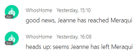

[](https://developer.cisco.com/codeexchange/github/repo/ObjectIsAdvantag/meraki-notifier)
# Meraki notifier to Webex Teams

This webhook listens to Meraki scanning notifications, and posts messages to a Webex Teams space as known devices are seen/leaving the Meraki SSID.

To run this code, you will need to:
1. a Meraki Access Point
2. create a scanning Webhook pointing to this code (exposed at a public URL / ngrok)
3. create a Teams Space and a Bot token
4. update the list of known Mac addresses in [people.js](./people.js)
5. launch the app with specified env variables (see below)

All set! please reach to your space and wait for notifications to fly in as devices connect




## Quick start on Glitch

Click [](https://glitch.com/edit/#!/import/github/ObjectIsAdvantag/meraki-notifier)

Then open the `.env` file and paste the Webex Teams info: bot's token and space id
You app is now running (with default Meraki settings).
Your app healthcheck is accessible at your webhook public url.

Open the Meraki dashboard, and create a scanning webhook pointing to your webhook URL on glitch.
Tip: add `/scanning` to the glitch public URL

Now, update the Meraki entry in `.env` with your meraki SSID, secret and validator.
And update the list of known Mac addresses in `./people.js`

All set! Connect your device it for notifications to fly in as devices connect


## Run locally

For **Mac, Linux and bash users**, open a terminal and type:

```shell
git clone https://github.com/ObjectIsAdvantag/meraki-notifier
cd meraki-notifier
npm install

DEBUG=meraquoi* TEAMS_SPACE=<your-space-id> TEAMS_TOKEN=<your-bot-token> MERAKI_SECRET=CiscoDevNet MERAKI_VALIDATOR=<from-meraki-dashboard> MERAKI_SSID=<your-SSID> node webhook.js
Meraki scanning webhook listening at: 8080
   GET  /          : for health checks
   POST /scanning  : to receive meraki scanning events node webhook.js
  
  meraquoi:purge cron checking every 1 minute(s), for not seen devices over 10 minute(s) +0ms
  meraquoi:purge time to purgeEntries, with 0 devices currently seen +44s
  meraquoi new scanning data received: Fri, 05 Apr 2019 08:36:13 GMT +0ms
  meraquoi processing payload with: 6 observations +3ms
  meraquoi device: 4c:66:41:15:9c:bc, from owner: Stève, detected on SSID:  Meraqui +1ms
  meraquoi updated last seen time to: 2019-04-05T08:35:04Z, for client: 4c:66:41:15:9c:bc +6ms
```

For **Windows users**, open a CMD shell and type:

```shell
git clone https://github.com/ObjectIsAdvantag/meraki-notifier
cd smartsheet-to-webex-teams
npm install
set DEBUG=meraquoi*
set TEAMS_SPACE=<your-space-id>
set TEAMS_TOKEN=<your-bot-token>
set MERAKI_SECRET=CiscoDevNet
set MERAKI_VALIDATOR=<from-meraki-dashboard>
set MERAKI_SSID=<your-SSID>
...
node webhook.js
```


**Done, your webhook is live**

Let's hit your app's healthcheck! 
From the command line, type:

```shell
curl -X GET http://localhost:8080
```

